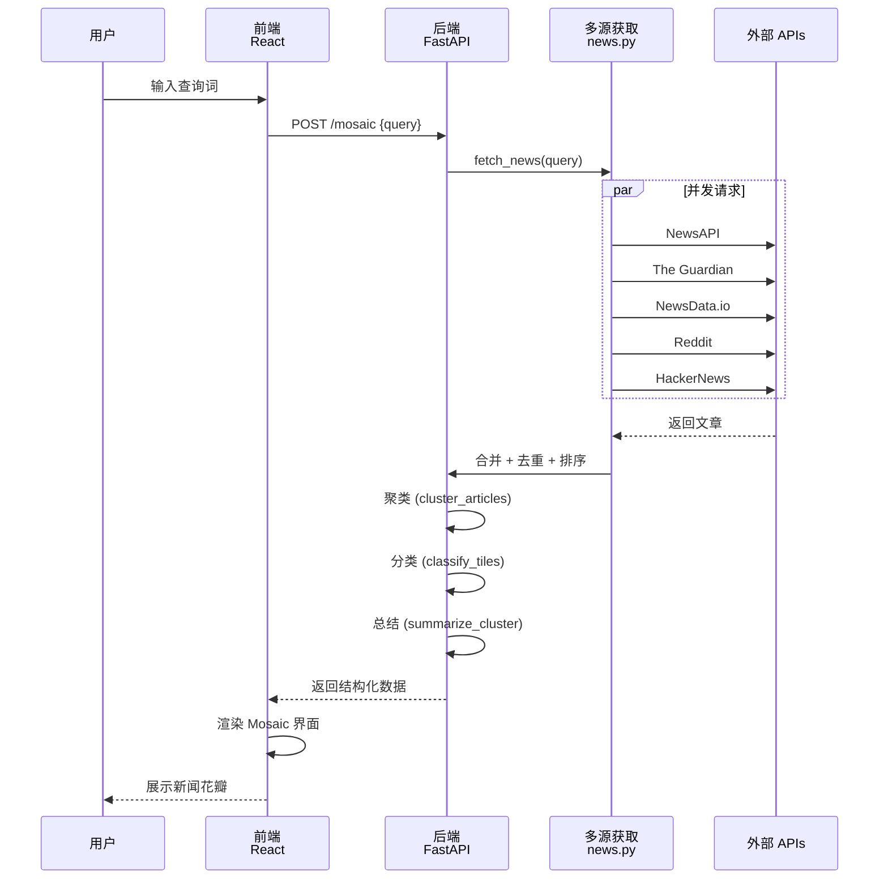

# 🏗️ News Mosaic 架构与集成方案

## 系统架构图

```
┌─────────────────────────────────────────────────────────────┐
│                     Frontend (React + Vite)                  │
│                  http://localhost:5173                       │
└──────────────────────┬──────────────────────────────────────┘
                       │
                       │ HTTP POST /mosaic
                       │
┌──────────────────────▼──────────────────────────────────────┐
│                   FastAPI Backend                            │
│                  http://localhost:8000                       │
│                                                               │
│  main.py                                                     │
│    └─ POST /mosaic {query, days, max_articles}             │
│       ├─ fetch_news()                                       │
│       ├─ cluster_articles()                                 │
│       ├─ classify_tiles()                                   │
│       └─ summarize_cluster()                                │
└──────────────────────┬──────────────────────────────────────┘
                       │
        ┌──────────────┼──────────────┐
        │              │              │
        ▼              ▼              ▼
   ┌────────────┐ ┌────────────┐ ┌────────────┐
   │Clustering  │ │Classification│ │LLM Service│
   │(sklearn)   │ │(Gemini API) │ │(Gemini)    │
   └────────────┘ └────────────┘ └────────────┘
        │
        │ fetch_news()
        │
    ┌───┴────────────────────────────────────────────────────┐
    │                                                          │
    ▼                                                          ▼
  news.py (多源聚合)                                          LLM
  │                                                            │
  ├─ fetch_from_newsapi()      ──────────────┐              │
  │  └─ NewsAPI                              │              │
  │     └─ 全球顶级媒体                      │  ┌──────────┘
  │                                          ▼  ▼
  ├─ fetch_from_guardian()      ──────────────┐
  │  └─ The Guardian API                      │
  │     └─ 英国顶级媒体                       │
  │                                           │
  ├─ fetch_from_newsdata()     ──────────────┤ 合并 ─┐
  │  └─ NewsData.io API                      │       │
  │     └─ 全球各地新闻源                    │       │
  │                                           │       ▼
  ├─ fetch_from_reddit()       ──────────────┤  去重/排序 ── 返回文章列表
  │  └─ Reddit OAuth API                     │       ▲
  │     └─ 社交讨论                          │       │
  │                                           │       │
  └─ fetch_from_hackernews()   ──────────────┘       │
     └─ HackerNews (Algolia)                         │
        └─ 科技社区讨论                              │
           └──────────────────────────────────────── 错误处理
```

---

## 数据流概览



---

## 代码结构

```
news-mosaic/
├── backend/
│   ├── app/
│   │   ├── main.py                 # 主接口 (FastAPI)
│   │   ├── news.py                 # ✨ 多源聚合 (新增/改进)
│   │   ├── models.py               # 数据模型
│   │   ├── settings.py             # ✨ 配置管理 (新增)
│   │   ├── mosaic.py               # 聚类算法
│   │   ├── llm.py                  # LLM 接口
│   │   └── sample_data.py          # 示例数据
│   ├── requirements.txt            # ✨ 依赖 (更新)
│   ├── .env.example                # ✨ 配置模板 (新增)
│   └── .env                        # ✨ 实际配置 (用户填写)
├── frontend/
│   ├── src/
│   │   ├── App.tsx
│   │   ├── api.ts
│   │   ├── components/
│   │   │   ├── MosaicBoard.tsx
│   │   │   ├── ClusterList.tsx
│   │   │   └── TileCard.tsx
│   │   └── pages/
│   │       └── Mosaic.tsx
│   ├── package.json
│   └── vite.config.ts
└── 文档/
    ├── API_REGISTRATION_GUIDE.md   # ✨ 注册指南 (新增)
    ├── QUICK_CHECKLIST.md          # ✨ 快速清单 (新增)
    ├── IMPLEMENTATION_COMPLETE.md  # ✨ 完成说明 (新增)
    └── ARCHITECTURE.md             # ✨ 本文档 (新增)
```

---

## 各新闻源详细说明

### 1. NewsAPI
- **URL**: https://newsapi.org
- **优势**: 聚合全球 50000+ 媒体源，质量高
- **免费配额**: 100 请求/天 (开发者)
- **认证**: API Key
- **状态**: ✅ 已配置默认 Key

### 2. HackerNews (Algolia)
- **URL**: https://hn.algolia.com/api/v1/search
- **优势**: 科技社区讨论，实时热门话题
- **免费配额**: 无限制
- **认证**: 无需认证
- **状态**: ✅ 无需注册，自动启用

### 3. The Guardian
- **URL**: https://open.theguardian.com/api
- **优势**: 英国顶级媒体，编辑质量高
- **免费配额**: 无限制
- **认证**: API Key (需要注册)
- **注册时间**: 1 分钟
- **状态**: 🔐 需要注册

### 4. NewsData.io
- **URL**: https://newsdata.io/api
- **优势**: 聚合全球各地新闻源，覆盖面广
- **免费配额**: 200 请求/天
- **认证**: API Key (需要注册)
- **注册时间**: 1 分钟
- **状态**: 🔐 需要注册

### 5. Reddit
- **URL**: https://oauth.reddit.com
- **优势**: 社交讨论和实时观点
- **免费配额**: 60 请求/分钟
- **认证**: OAuth Client ID + Secret
- **注册时间**: 5 分钟 (需要 Reddit 账号)
- **状态**: 🔐 可选，需要注册

---

## API 调用流程详解

### fetch_news() 主流程

```python
async def fetch_news(query: str, days: int, max_articles: int) -> list[Article]:
    # 1️⃣ 检查配置
    if not (ENABLE_NEWS_API or ... or ENABLE_HACKERNEWS):
        return SAMPLE_ARTICLES[:max_articles]
    
    # 2️⃣ 准备任务列表
    tasks = []
    if ENABLE_NEWS_API:
        tasks.append(fetch_from_newsapi(query, max_articles))
    if ENABLE_GUARDIAN:
        tasks.append(fetch_from_guardian(query, max_articles))
    # ... 其他来源 ...
    
    # 3️⃣ 并发执行
    results = await asyncio.gather(*tasks)
    
    # 4️⃣ 合并结果
    all_articles = []
    for articles in results:
        all_articles.extend(articles)
    
    # 5️⃣ 去重
    seen = set()
    deduped = []
    for art in all_articles:
        key = art.title.strip().lower()
        if key not in seen:
            seen.add(key)
            deduped.append(art)
    
    # 6️⃣ 排序 (最新在前)
    deduped.sort(key=lambda x: x.published_at, reverse=True)
    
    # 7️⃣ 截取返回
    return deduped[:max_articles]
```

---

## 并发优化

### 为什么使用 asyncio.gather?

```python
# ❌ 串行 (慢) - 需要 20 秒
async def fetch_news_serial():
    news_api = await fetch_from_newsapi(query, max)  # 4 秒
    guardian = await fetch_from_guardian(query, max)  # 4 秒
    newsdata = await fetch_from_newsdata(query, max)  # 4 秒
    reddit = await fetch_from_reddit(query, max)      # 4 秒
    hn = await fetch_from_hackernews(query, max)      # 4 秒
    # 总时间: 4+4+4+4+4 = 20 秒 ❌

# ✅ 并发 (快) - 需要 4 秒
async def fetch_news_concurrent():
    results = await asyncio.gather(
        fetch_from_newsapi(query, max),
        fetch_from_guardian(query, max),
        fetch_from_newsdata(query, max),
        fetch_from_reddit(query, max),
        fetch_from_hackernews(query, max),
    )
    # 总时间: max(4,4,4,4,4) = 4 秒 ✅
```

---

## 错误处理策略

每个来源都独立包装在 `try-except` 中：

```python
async def fetch_from_guardian(query: str, max_articles: int) -> list[Article]:
    if not ENABLE_GUARDIAN:
        return []
    
    try:
        async with httpx.AsyncClient(timeout=20) as client:
            r = await client.get(url, params=params)
            r.raise_for_status()
            # ... 处理数据 ...
        return articles
    except Exception as e:
        print(f"❌ The Guardian 错误: {e}")
        return []  # 返回空列表，不中断流程
```

**好处**:
- 一个 API 超时不会导致整个系统失败
- 用户始终能获得其他来源的数据
- 错误日志记录便于调试

---

## 性能指标

### 响应时间 (预期)
- 单个 API 调用: 2-4 秒
- 5 个 API 并发: 4-5 秒 (主要受最慢的限制)
- 聚类 + 分类 + 总结: 2-10 秒
- **总响应时间**: 6-15 秒

### 数据量 (预期)
- 每个 API: 10-30 篇
- 并发 5 个: 50-150 篇
- 去重后: 30-100 篇 (取决于查询词)
- 最终返回: 60 篇 (max_articles=60)

---

## 环境变量配置

### 自动启用/禁用机制

```python
ENABLE_NEWS_API = True  # 总是启用
ENABLE_GUARDIAN = bool(GUARDIAN_API_KEY.strip())  # 有 Key 时启用
ENABLE_NEWSDATA = bool(NEWSDATA_API_KEY.strip())  # 有 Key 时启用
ENABLE_REDDIT = bool(REDDIT_CLIENT_ID.strip() and REDDIT_CLIENT_SECRET.strip())
ENABLE_HACKERNEWS = True  # 总是启用
```

**优势**:
- 无需代码修改，只需改配置
- 缺少 Key 时自动禁用该源
- 易于调试 (删除 Key 即可禁用)

---

## 扩展指南 (添加新来源)

如果你想添加新的新闻来源，只需:

1. **在 settings.py 中添加配置**:
   ```python
   NEW_SOURCE_API_KEY = os.getenv("NEW_SOURCE_API_KEY", "")
   ENABLE_NEW_SOURCE = bool(NEW_SOURCE_API_KEY.strip())
   ```

2. **在 news.py 中添加适配器**:
   ```python
   async def fetch_from_new_source(query: str, max_articles: int) -> list[Article]:
       if not ENABLE_NEW_SOURCE:
           return []
       try:
           # ... 调用 API ...
           return articles
       except Exception as e:
           print(f"❌ New Source 错误: {e}")
           return []
   ```

3. **在 fetch_news() 中添加**:
   ```python
   if ENABLE_NEW_SOURCE:
       tasks.append(fetch_from_new_source(query, max_articles))
   ```

就这么简单！✨

---

## 总结

News Mosaic 现在是一个**强大的多源新闻聚合系统**，具有:

✅ **5 个独立的新闻来源**
✅ **并发获取，高效快速**
✅ **完整的错误处理**
✅ **灵活的配置系统**
✅ **可扩展的架构**
✅ **详细的日志输出**

现在就去注册 API Keys，体验完整的功能吧！🚀
