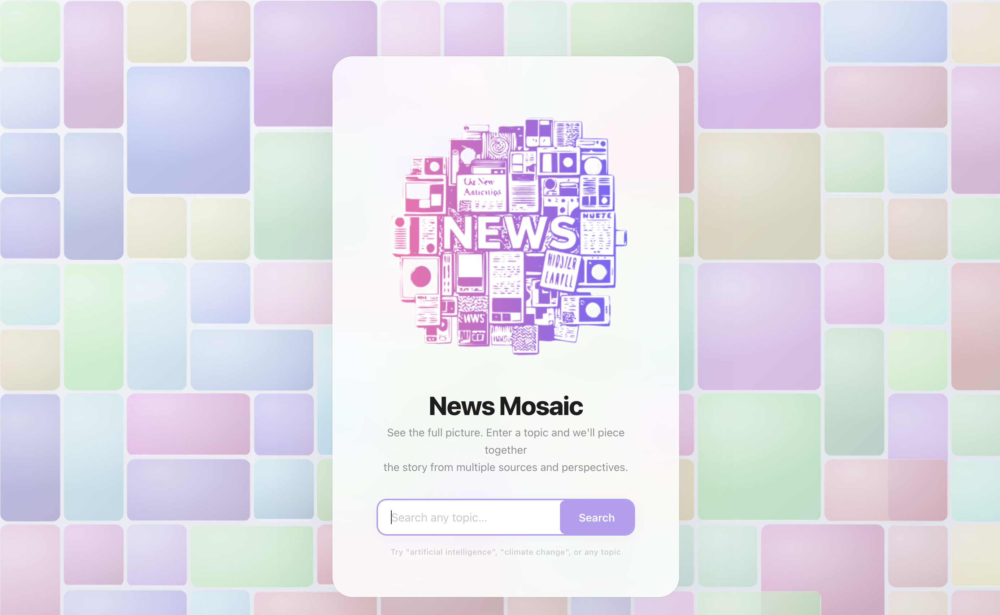
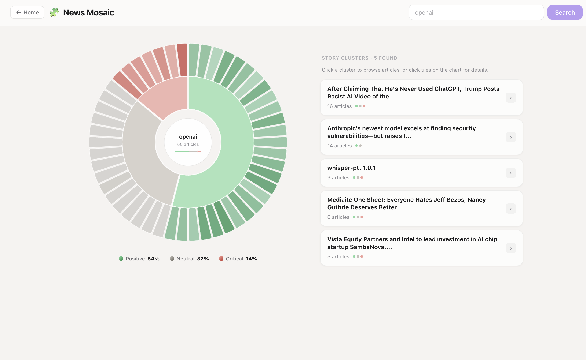

# 🧩 News Mosaic

**See the full picture — not a ranked feed.**

News Mosaic is an interactive news visualization tool designed to break information out of traditional echo chambers.  
Instead of a ranked news feed, we show **multiple perspectives at once** using an interactive radial visualization.

---

## 🌍 What Is News Mosaic?

When you search a topic, News Mosaic:

1. Fetches news articles from multiple sources  
2. Clusters them into related story groups  
3. Classifies article tone (positive / neutral / critical)  
4. Displays everything in a radial mosaic view  

This allows users to **see the debate landscape**, not just the loudest or most popular take.

News Mosaic was created to help people:
See the whole conversation — not just the algorithm’s favorite slice.

---

## 📸 Screenshots

### 🏠 Landing Page
*(Search for any topic to begin exploring)*



---

### 🌀 Radial Mosaic View

Each topic becomes a radial map of perspectives.

- Center: Your search topic  
- Inner ring: Story clusters  
- Outer ring: Individual articles  
- Colors represent tone  

🟢 Positive  ⚪ Neutral  🔴 Critical



---

### 🧭 Another Topic Example

Different topics produce very different perspective balances.


---

## ✨ Features

### 🧩 Multi-Perspective View
We **do not sort by popularity or time**.  
Instead, we display the *full spread of perspectives* around a topic.

### 🌀 Radial Sunburst Visualization
Interactive radial chart for exploring clusters and articles visually.

### 🧠 Sentiment Awareness
Each article is labeled as:
- **Positive** – supportive framing
- **Neutral** – informational tone
- **Critical** – negative or risk-focused framing

Users can intentionally explore viewpoints they might not normally see.

---

## 🛠 Tech Stack

### Backend
- FastAPI
- News API fetching
- Article clustering logic
- LLM-powered classification and summarization

### Frontend
- React + Vite
- D3.js radial visualization
- Responsive UI design

---

## ⚙️ How It Works

1. User enters a topic  
2. Backend fetches articles  
3. Articles are clustered by similarity  
4. LLM classifies article tone  
5. Frontend renders the radial mosaic  

---

## 💻 Install & Run Locally

### 🐍 Backend

```bash
cd backend
python -m venv .venv
source .venv/bin/activate
pip install -r requirements.txt
uvicorn app.main:app --reload --port 8000
```
Create a .env file inside backend/:

```bash
NEWS_API_KEY=your_news_api_key
OPENAI_API_KEY=your_openai_api_key
```

### ⚛️ Frontend

```bash
cd frontend
npm install
npm run dev
```

Open your browser:
```bash
http://localhost:5173
```
